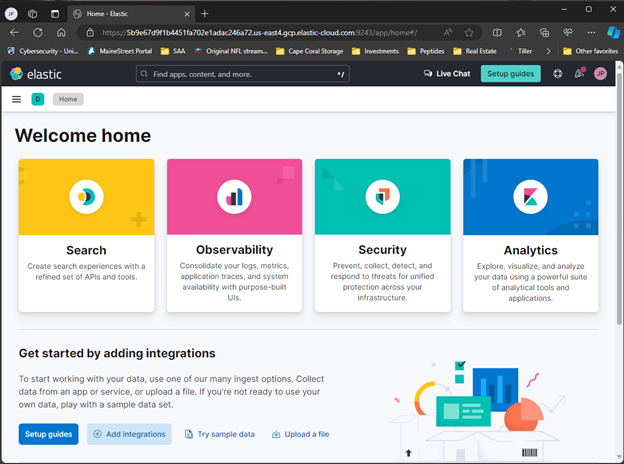
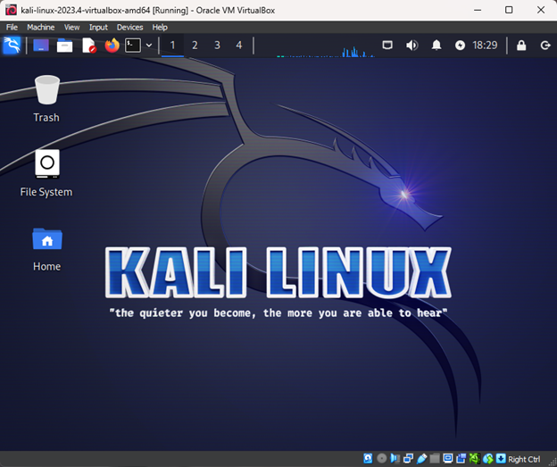
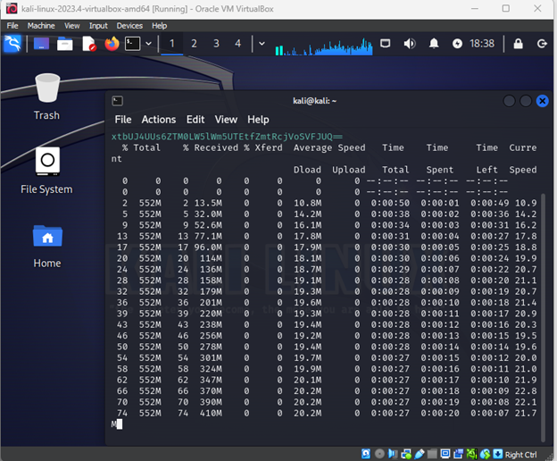
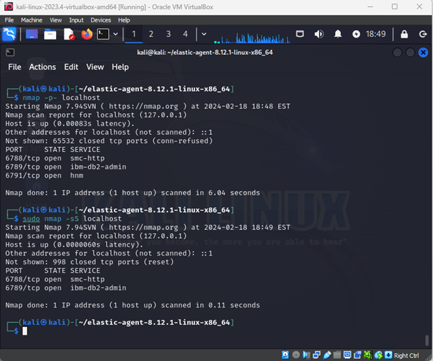
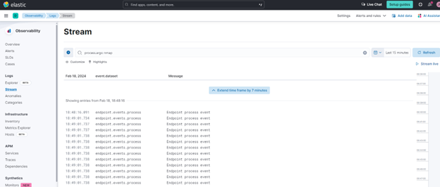
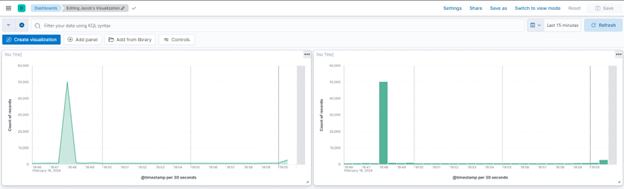
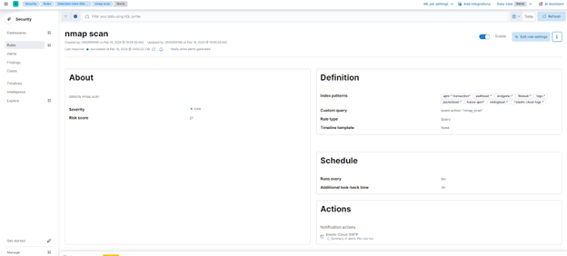

# Elastic SIEM Lab Documentation

## Task 1: Set Up an Elastic Account

**Objective:** Create a free Elastic Cloud account and set up a cloud Elastic instance.

**Steps:**
1. Register for a free trial at Elastic Cloud.
2. Log into the Elastic Cloud console.
3. Start the free trial and create an Elasticsearch deployment.
4. Choose the appropriate region and deployment size.
5. Complete the deployment setup and click "continue."

## Task 2: Setting Up the Linux VM

**Objective:** Install and set up a Kali Linux VM using VirtualBox or VMware.

**Steps:**
1. Download Kali Linux VM.
2. Create a new VM and install Kali Linux.
3. Log into Kali using default credentials.

## Task 3: Setting Up the Agent to Collect Logs

**Objective:** Install the Elastic Agent on the Kali VM to collect and forward logs.

**Steps:**
1. Navigate to the Integrations page in your Elastic SIEM instance.
2. Find and install the "Elastic Defend" integration.
3. Copy and run the provided command in the Kali terminal.
4. Verify the agent installation.

## Task 4: Generating Security Events on the Kali VM

**Objective:** Use Nmap to generate security-related events.

**Steps:**
1. Install Nmap if necessary.
2. Run Nmap scans on the specified targets.
3. Generate various security events using different Nmap commands.

## Task 5: Querying for Security Events in the Elastic SIEM

**Objective:** Query and analyze logs in Elastic SIEM.

**Steps:**
1. Navigate to the "Logs" tab in Elastic Deployment.
2. Enter search queries to filter logs related to Nmap scans.
3. Execute the search and review the results.

## Task 6: Create a Dashboard to Visualize the Events

**Objective:** Build a dashboard in Elastic SIEM to visualize security events.

**Steps:**
1. Access the Elastic web portal and navigate to "Dashboards."
2. Create a new dashboard and add visualizations.
3. Configure the visualization to display event counts over time.

## Task 7: Create an Alert

**Objective:** Set up an alert in Elastic SIEM to detect Nmap scans.

**Steps:**
1. Go to "Alerts" under "Security" and manage rules.
2. Create a new rule with a custom query for detecting Nmap scans.
3. Configure the alert's actions and enable the rule.

## Conclusion

This lab provided hands-on experience with setting up Elastic SIEM, configuring a Linux VM for log collection, generating security events, querying logs, visualizing data, and creating alerts. Fill in each section with the appropriate screenshots as you complete the tasks to document your lab process.
