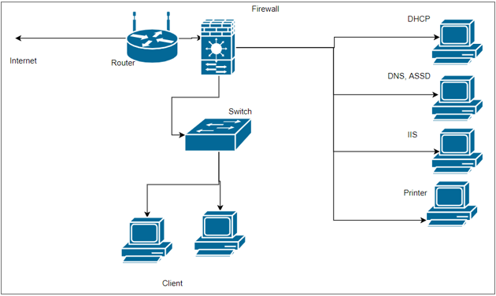

# Blue Team Network Security Strategy

## Executive Summary

This document presents a comprehensive Blue Team defensive strategy for a multi-device star topology network. Each network component is analyzed for its specific vulnerabilities, and targeted hardening measures are prescribed to ensure robust protection against unauthorized access, data breaches, and cyber threats.

## Network Analysis Overview

The network is structured using a star topology encompassing:
- Wireless gateway router
- Network switch
- Multiple client computers
- DHCP server
- DNS/Active Directory Domain Services (ADDS) server
- IIS web server
- Network printer

The topology provides dedicated communication pathways, however, initial evaluation identified significant security gaps — most critically the absence of password protection on key network devices.

## Network Diagram

## Device-Specific Hardening Strategies

### Router

| Aspect | Details |
|--------|---------|
| **Vulnerability** | No password protection — susceptible to unauthorized access and network eavesdropping |
| **Hardening** | Implement strong password protocols with AES encryption; enable firewall capabilities and IDS; schedule regular firmware updates; disable unnecessary services and protocols |

### Switch

| Aspect | Details |
|--------|---------|
| **Vulnerability** | No password protection — allows unauthorized configuration changes and potential network compromise |
| **Hardening** | Secure with complex password and enable port security; configure VLANs to segregate traffic and reduce attack surface; enable SPAN (Switched Port Analyzer) for traffic monitoring |

### Client Computers

| Aspect | Details |
|--------|---------|
| **Vulnerability** | Exposed to malware and targeted attacks, risking network integrity and confidentiality |
| **Hardening** | Deploy up-to-date antivirus/antimalware; implement strict GPOs for configuration and access control; conduct user security awareness training against phishing and social engineering |

### DHCP Server

| Aspect | Details |
|--------|---------|
| **Vulnerability** | Simple passwords and no segmentation from client access |
| **Hardening** | Enforce complex password policy; isolate in a dedicated VLAN with restricted access; enable DHCP snooping on the switch to prevent rogue DHCP servers |

### DNS/ADDS Server

| Aspect | Details |
|--------|---------|
| **Vulnerability** | Exposure to DNS cache poisoning, amplification attacks, and unauthorized AD modifications |
| **Hardening** | Harden DNS against cache poisoning and amplification; enforce least privilege in Active Directory with regular audits; implement MFA for privileged accounts |

### IIS Web Server

| Aspect | Details |
|--------|---------|
| **Vulnerability** | Prime target for service disruption and unauthorized access attacks |
| **Hardening** | Maintain current patches for OS and applications; deploy a Web Application Firewall (WAF); regularly review web server logs for suspicious activity |

### Network Printer

| Aspect | Details |
|--------|---------|
| **Vulnerability** | Often overlooked entry point — default credentials and unnecessary services |
| **Hardening** | Change default credentials and update firmware regularly; restrict print jobs to authorized network segments only; disable unnecessary protocols and management interfaces |

## Conclusion

By addressing the specific vulnerabilities of each device in the network, this strategy builds a layered security posture that protects against a wide spectrum of threats. Security is applied as a tailored fit for each component's role and risk profile, rather than a one-size-fits-all approach — ensuring that the network's architecture is defended at every level.
