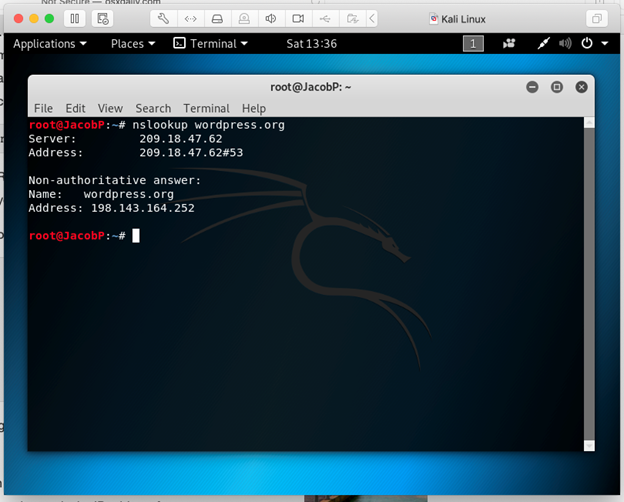
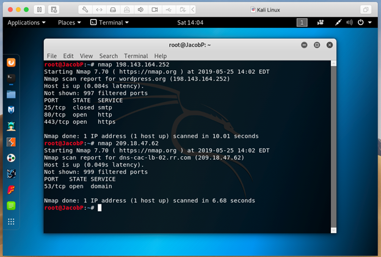
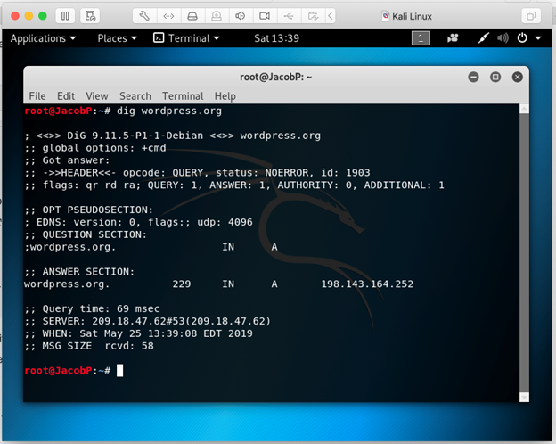
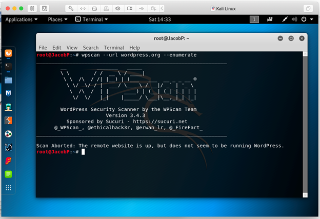

# Passive Information Gathering on wordpress.org

## Overview

This document outlines the methods used for passive information gathering on the domain `wordpress.org`. Passive reconnaissance is a critical first step in the cybersecurity assessment process, as it allows for the collection of information without direct interaction with the target system. Tools such as `nslookup`, `dig`, `Nmap`, and `WPscan` were utilized to gather data.

## Methods and Findings

### nslookup

`nslookup` is a network administration command-line tool used for querying the Domain Name System (DNS) to obtain domain name or IP address mapping. For `wordpress.org`, `nslookup` provided the server's IP address and indicated the authoritative status of the response.

- **Server and Address**: Identified the DNS server used and its IP address.
- **Non-authoritative Answer**: Displayed the domain name and its associated IP address.

### Nmap

`Nmap` ("Network Mapper") is an open-source tool for network discovery and security auditing. It was used to scan for open ports on the IP addresses associated with `wordpress.org`.

- **Open Ports**: Determined the state of ports and the services running on them, which is crucial for identifying potential vulnerabilities.

### dig

The `dig` command is used for probing DNS name servers. It provides detailed information about domain names, including their A records (addresses).

- **A Records**: Revealed the numerical IP addresses corresponding to `wordpress.org`, which is valuable for bypassing DNS resolution in subsequent tests.

### WPscan

`WPscan` is a black box WordPress vulnerability scanner. An attempt was made to use `WPscan` to enumerate the WordPress site details, but the scan was aborted as the target did not appear to be a WordPress site.

- **Error**: Indicates the importance of verifying the platform before running platform-specific tools to avoid unnecessary errors.

## Conclusion

The passive information gathering conducted on `wordpress.org` using various tools provided foundational data that will inform further security analysis. Understanding the DNS structure, open ports, and services running on the target system is essential for a comprehensive security assessment.
