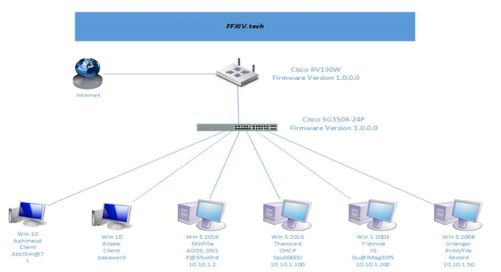

# Red Team Analysis for FFVVI.tech Network

## Executive Summary

This report details a Red Team engagement conducted to evaluate the security posture of FFVVI.tech's network. The Red Team used adversarial tactics — including social engineering, physical security testing, and application-layer attacks — to identify exploitable vulnerabilities. The findings contrast with the Blue Team's defensive assessment and provide actionable recommendations for remediation.

## Network Overview

The FFVVI.tech network includes Windows clients, servers, and network devices. Each component's security controls were evaluated from an attacker's perspective to assess the network's resilience against real-world threats.

## Network Topology

## Pre-Assessment: Reconnaissance

### Social Engineering

The Red Team employed email and telephony social engineering techniques to acquire credentials that were improperly secured. Exposed client passwords allowed unauthorized access to networked machines, demonstrating that human factors remain a critical vulnerability regardless of technical controls.

### Exploitation Tactics

#### Network Services Layer

The absence of a centralized firewall was a critical vulnerability. Without network-level access control, the team accessed files directly from endpoint machines, demonstrating the potential for data exfiltration in an unprotected environment.

#### Physical Security Layer

Physical security assessments revealed inadequate access controls:
- Several devices had no password protection.
- Others used easily guessable credentials (default or simple passwords).
- No physical access logging or badge-controlled entry was in place.

#### Application Layer

Web applications and databases were tested for common vulnerabilities:
- **SQL Injection:** Successfully extracted data from backend databases through unsanitized input fields.
- **Cross-Site Scripting (XSS):** Injected malicious scripts that executed in other users' browsers, demonstrating the potential for session hijacking and credential theft.

## Red Team Methodology

### 1. Scope Definition
Defined engagement rules and objectives: identify exploitable vulnerabilities from an external attacker's perspective while staying within authorized boundaries.

### 2. Reconnaissance & Intelligence Gathering
Collected device IP addresses, API endpoints, employee information, network topology details, and service fingerprints to map the attack surface.

### 3. Attack Planning
Mapped attack vectors based on reconnaissance findings, including:
- Exposed services with default configurations
- Subdomain enumeration for hidden attack surfaces
- Cloud architecture misconfigurations

### 4. Exploitation
Key findings during the attack phase:
- Without firewall protection, hardware components were accessible remotely.
- Software could be remotely uninstalled due to lack of endpoint protection policies.
- The absence of VLAN segmentation allowed lateral movement across the entire network from a single compromised host.

### 5. Security Controls Assessment
Endpoint security applications (antivirus software) were tested and found inadequate — outdated signatures and missing real-time protection allowed malware execution without detection.

## Critical Findings Summary

| Finding | Severity | Impact |
|---------|----------|--------|
| No centralized firewall | Critical | Unrestricted network access from any entry point |
| Default/missing passwords on devices | Critical | Trivial unauthorized access to network infrastructure |
| No VLAN segmentation | High | Lateral movement across entire network from single host |
| SQL injection in web applications | High | Database exfiltration and potential privilege escalation |
| XSS vulnerabilities | Medium | Session hijacking and credential theft |
| Outdated antivirus with missing signatures | Medium | Malware execution without detection |
| No physical access controls | Medium | Unauthorized physical access to network equipment |

## Conclusion

The Red Team assessment revealed multiple critical and high-severity vulnerabilities across all layers of FFVVI.tech's network. The most urgent remediation priorities are implementing a centralized firewall, enforcing strong password policies across all devices, segmenting the network with VLANs, and remediating the SQL injection and XSS vulnerabilities in web applications.
