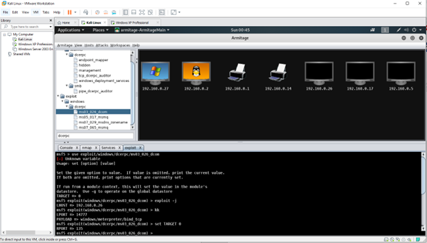
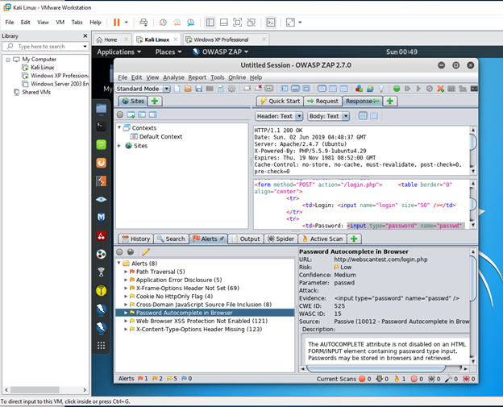

# Web Application Exploits: A Practical Approach

## Introduction

This guide demonstrates practical approaches to uncovering web application vulnerabilities, utilizing Armitage, OWASP ZAP, and Burp Suite.

## Armitage: Penetrating Windows XP

### Overview
Armitage facilitated a direct connection to a Windows XP target, showcasing exploit execution capabilities.

## OWASP ZAP: Identifying Vulnerabilities

### Overview
A quick scan with OWASP ZAP revealed several security issues, including the password autocomplete vulnerability.

## Burp Suite: Intercepting Web Traffic

### Overview
Burp Suite's intercept feature was used to analyze HTTP/S traffic, identifying potential vulnerabilities in web application interactions.

## Conclusion

These tools are indispensable for cybersecurity professionals to secure web applications, offering insights into vulnerabilities and mitigation strategies.
