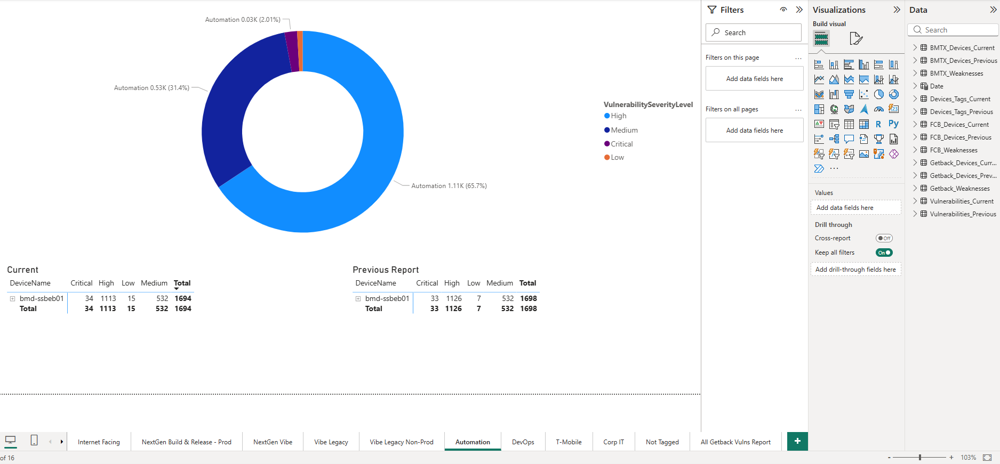
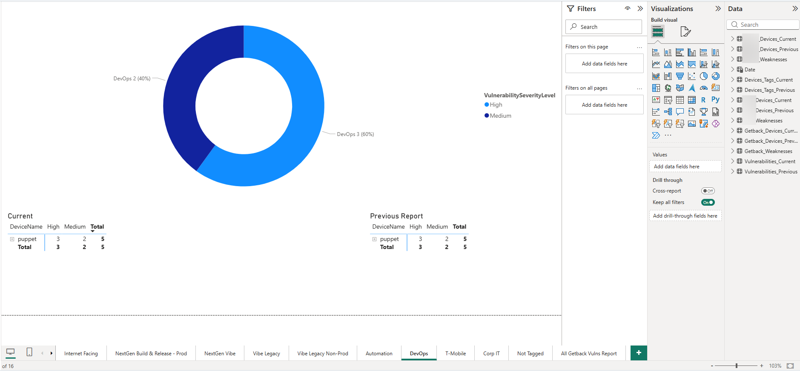

# Vulnerability Report - Microsoft Defender & Power BI

## Objective
To build a comprehensive vulnerability report using Microsoft Defender vulnerability data across multiple tenants, visualized through Power BI dashboards for actionable security insights and prioritized remediation.

## Overview
This project demonstrates the process of collecting, analyzing, and presenting vulnerability data from Microsoft Defender for Endpoint using Power BI. The report covers a multi-tenant environment, pulling device inventories, vulnerability assessments, and CVE data from three separate Defender tenants. Data is transformed via Power Query (M language), loaded into a relational model, and presented through interactive dashboards that support biweekly exposure reporting and risk-based decision making.

> **Note:** All company names, tenant identifiers, device hostnames, and internal domain names have been redacted and replaced with generic labels (Tenant_A, Tenant_B, Tenant_C) to protect confidential information.

## Tools & Technologies
- **Microsoft Defender for Endpoint:** Source of vulnerability and threat data across managed devices.
- **Microsoft Power BI:** Data visualization and dashboard platform for building the report.
- **Power Query (M Language):** Data ingestion, transformation, and modeling within Power BI.
- **Microsoft 365 Defender Portal:** Central console for reviewing security recommendations and exposure scores.

## Data Sources
- **Device Inventory Exports (CSV):** Per-tenant device lists exported from Defender, containing device name, OS platform, tags, and onboarding status.
- **Vulnerability Exports (JSON/NDJSON):** Per-device CVE mappings exported from Defender's TVM module, including severity, exploitability, and age data.
- **Weaknesses Exports (XLSX):** TVM vulnerability spreadsheets with known-threat flags, age in days, and exposed machine counts.

## Report Architecture

The Power BI report is built on a multi-tenant data model with the following structure:

### Data Ingestion Queries
Each tenant has dedicated Power Query scripts for:
- **Devices (Current & Previous):** Import CSV device inventories, strip unnecessary columns, tag with tenant name, and standardize schema.
- **Weaknesses:** Dynamically locate the latest TVM vulnerability export (XLSX), filter to rows with known threats, and add age-category buckets (1-30 days, 30-90 days, 90-180 days, 180-365 days, 1+ years).
- **Vulnerabilities (Current & Previous):** A reusable `fn_LoadVulnerabilities` function that loads NDJSON/JSON.GZ files by date tag across all three tenant folders, parses each line, expands dynamic fields, and deduplicates by DeviceName + CveId + Tenant.

### Consolidated Views
- **Devices_Tags_Current / Devices_Tags_Previous:** Combines all three tenant device tables into a single unified view for cross-tenant analysis.

## Dashboard Pages

The report contains 16 interactive dashboard pages organized by device tag/group:

### Internet Facing
Monitors internet-exposed VMs and highlights any with exploitable vulnerabilities.

### NextGen Build & Release - Prod
Tracks vulnerabilities on production build and release agent VMs, comparing current vs. previous reporting periods.

### NextGen Vibe
Covers the NextGen Vibe application server group with severity breakdown by device.

### Vibe Legacy
Displays vulnerability counts for legacy Vibe application servers.

### Vibe Legacy Non-Prod
Non-production legacy Vibe environment vulnerability tracking.

### Automation
Shows vulnerability posture for automation infrastructure devices.

### DevOps
Tracks vulnerabilities on DevOps tooling servers.

### T-Mobile
Vulnerability overview for the T-Mobile tagged device group.

### Corp IT
Corporate IT device group vulnerability summary with current vs. previous comparison.

### Not Tagged
Catches devices that haven't been assigned to a tag group — useful for identifying coverage gaps.

### All Tenant A Vulns Report
Consolidated donut chart and device table for all Tenant A vulnerabilities by severity.

### Tenant A Vulnerability Trends Over Time
CVE age analysis with bar chart by age category and a detailed CVE table showing severity, exposed machine count, and age bucket.

### All Tenant B Vulns Report
Consolidated view of all Tenant B vulnerabilities with device-level breakdown.

### Tenant B Vulnerability Trends Over Time
CVE trending and age analysis for Tenant B, tracking exposed machines by severity over time.

### All Getback Vulns Report
Full vulnerability summary across the Getback tenant environment with tag-level donut chart breakdown.

### Getback Vulnerability Trends Over Time
Age-based CVE analysis for Getback, identifying long-standing vulnerabilities requiring attention.

## Power Query Scripts

The data pipeline is powered by custom Power Query (M) scripts. Each query handles a specific data source and tenant:

### Device Inventory Queries
- [`Tenant_A_Devices_Current.txt`](Images/Tenant_A_Devices_Current.txt) — Imports current Tenant A device inventory from CSV
- [`Tenant_A_Devices_Previous.txt`](Images/Tenant_A_Devices_Previous.txt) — Imports previous period Tenant A device inventory
- [`Tenant_B_Devices_Current.txt`](Images/Tenant_B_Devices_Current.txt) — Imports current Tenant B device inventory
- [`Tenant_B_Devices_Previous.txt`](Images/Tenant_B_Devices_Previous.txt) — Imports previous period Tenant B device inventory
- [`Tenant_C_Devices_Current.txt`](Images/Tenant_C_Devices_Current.txt) — Imports current Tenant C device inventory
- [`Tenant_C_Devices_Previous.txt`](Images/Tenant_C_Devices_Previous.txt) — Imports previous period Tenant C device inventory

### Weaknesses / CVE Queries
- [`Tenant_A_Weaknesses.txt`](Images/Tenant_A_Weaknesses.txt) — Loads latest TVM vulnerability export for Tenant A, filters to known threats, adds age categories
- [`Tenant_B_Weaknesses.txt`](Images/Tenant_B_Weaknesses.txt) — Same pattern for Tenant B
- [`Tenant_C_Weaknesses.txt`](Images/Tenant_C_Weaknesses.txt) — Same pattern for Tenant C

### Consolidated & Function Queries
- [`Devices_Tags_Current.txt`](Images/Devices_Tags_Current.txt) — Combines all three tenant device tables (current period) into one unified view
- [`Devices_Tags_Previous.txt`](Images/Devices_Tags_Previous.txt) — Combines all three tenant device tables (previous period)
- [`fn_LoadVulnerabilities.txt`](Images/fn_LoadVulnerabilities.txt) — Reusable function that loads and parses NDJSON/JSON.GZ vulnerability exports across all tenants by date tag
- [`Vulnerabilities_Current.txt`](Images/Vulnerabilities_Current.txt) — Calls `fn_LoadVulnerabilities` for the current reporting date
- [`Vulnerabilities_Previous.txt`](Images/Vulnerabilities_Previous.txt) — Calls `fn_LoadVulnerabilities` for the previous reporting date

## Methodology

### 1. Data Export from Microsoft Defender
- Exported device inventories as CSV from each Defender tenant.
- Exported TVM vulnerability data as NDJSON (gzipped) and weaknesses reports as XLSX.
- Organized exports into per-tenant folders with date-tagged filenames for biweekly tracking.

### 2. Data Transformation in Power BI
- Built Power Query scripts to ingest CSV, XLSX, and NDJSON/JSON.GZ files dynamically.
- Stripped unnecessary columns from device exports (IPs, MACs, enrollment details) to keep the model lean.
- Created a reusable `fn_LoadVulnerabilities` function to parse multi-format vulnerability exports across all tenants.
- Added computed columns: Tenant tags, Age Categories (1-30 days through 1+ years), and normalized boolean fields.
- Deduplicated vulnerability records by DeviceName + CveId + Tenant.

### 3. Dashboard Design
- Built 16 interactive dashboard pages — one per device tag/group plus tenant-wide summaries and trend views.
- Each page features a donut chart (severity distribution), current vs. previous device tables, and vulnerability totals.
- Trend pages include bar charts by age category and severity, plus detailed CVE tables with exposed machine counts.
- Applied conditional formatting to highlight critical and high-severity findings.

### 4. Biweekly Reporting Workflow
- The report is designed for biweekly refresh cycles: swap the date tag in `Vulnerabilities_Current` / `Vulnerabilities_Previous` and refresh.
- Current vs. previous comparison tables enable stakeholders to see remediation progress at a glance.

## Key Findings
- Consolidated visibility into vulnerability posture across three Defender tenants and all device groups.
- Identified high-severity CVEs with known exploits aging over 1+ years that required priority patching.
- Tag-based grouping revealed which infrastructure segments carried the most risk (e.g., Corp IT and Getback environments had the highest vulnerability counts).
- Biweekly comparison showed remediation trends and helped track mean time to remediate across reporting periods.

## Conclusion
This project showcases the ability to leverage Microsoft Defender for Endpoint as a vulnerability data source and Power BI as a reporting platform to build a professional, multi-tenant vulnerability management report. The combination of automated data ingestion via Power Query, structured multi-tenant analysis, and interactive visualization supports proactive security operations and informed risk management decisions.

## References
- [Microsoft Defender for Endpoint Documentation](https://learn.microsoft.com/en-us/microsoft-365/security/defender-endpoint/)
- [Power BI Documentation](https://learn.microsoft.com/en-us/power-bi/)
- [Microsoft Defender Vulnerability Management](https://learn.microsoft.com/en-us/microsoft-365/security/defender-vulnerability-management/)
- [Power Query M Language Reference](https://learn.microsoft.com/en-us/powerquery-m/)
- [CVSS - Common Vulnerability Scoring System](https://www.first.org/cvss/)
